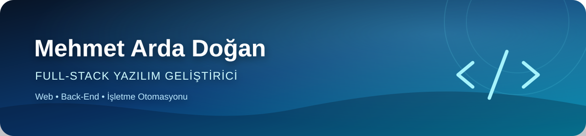

 

**Saha operasyonlarını sade, güvenilir ve ölçeklenebilir dijital ürünlere dönüştürüyorum.**

 

## 👋 Hakkımda

Mersin merkezli bir yazılım geliştirici ve **Bilgisayar Programcılığı öğrencisiyim**. Node.js, Express, ilişkisel veritabanları, REST API'ler ve işletme süreçlerinin dijitalleştirilmesi üzerine çalışıyorum.

**Mehmet Arda Studio** çatısı altında kurumsal web siteleri ve işletmeye özel yazılımlar geliştiriyor; ihtiyaç analizinden arayüz ve back-end geliştirmeye, yayına alma ve teknik desteğe kadar süreci uçtan uca yürütüyorum.

 

## 🚀 Öne Çıkan Çalışmalar

<table>
<tr>
<td width="50%" valign="top">
<h3>🚚 Delivera Express</h3>

<strong>Kurye ve sipariş operasyon platformu</strong>

Restoran, yönetici ve kurye süreçlerini tek merkezde yöneten; saha operasyonlarını hızlandırmaya odaklanan özel ürün çalışması.

✓ Rol bazlı yönetim deneyimleri ✓ Sipariş ve kurye operasyonları ✓ Güvenilir API entegrasyonları ✓ Web ve mobil kullanım

<code>Node.js</code> <code>Express</code> <code>PostgreSQL</code> <code>Redis</code>

<strong>🔒 Kaynak kodu ve teknik ayrıntılar özeldir.</strong>

</td>
<td width="50%" valign="top">
<h3>🌐 Ardashop</h3>

<strong>Web tasarım ve dijital çözümler vitrini</strong>

Hizmetleri ve seçili çalışmaları hızlı, anlaşılır ve mobil uyumlu bir deneyimle sunan kurumsal web projesi.

✓ Modern ve duyarlı arayüz ✓ Hız ve kullanılabilirlik ✓ SEO uyumlu içerik düzeni ✓ Canlı yayın ve bakım

<code>HTML5</code> <code>CSS3</code> <code>JavaScript</code> <code>SEO</code>

<a href="https://ardashop.site"><strong>Canlı siteyi görüntüle →</strong></a>

</td>
</tr>
</table>

 

## 🧰 Teknoloji Setim

 

| Alan | Yetkinlikler |
|:--|:--|
| **Back-End** | Node.js · Express.js · REST API · Authentication · Webhooks |
| **Veri** | PostgreSQL · SQLite · Redis |
| **Front-End** | HTML5 · CSS3 · JavaScript · Responsive Design |
| **DevOps & Araçlar** | Git · GitHub · Docker · Linux · Nginx · Postman |
| **Ürün Alanları** | Sipariş yönetimi · Kurye operasyonları · İşletme otomasyonu |

 

## 🎓 Eğitim

### 💻 Bilgisayar Programcılığı
**Ön lisans · Devam ediyor · 2025–**

### 🏥 Tıbbi Dokümantasyon ve Sekreterlik
**Anadolu Üniversitesi Açıköğretim Fakültesi · Devam ediyor · 2025–**

 

---

### Bir fikri ürüne dönüştürelim

Web uygulamaları, back-end sistemleri ve işletme otomasyonu projeleri için bağlantı kurabilirsiniz.

Mehmet Arda Doğan · Mersin, Türkiye

